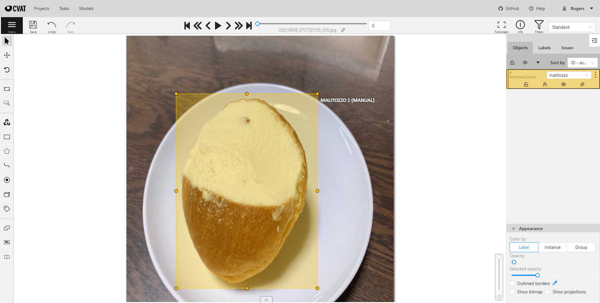

This repo is available in [English](README_EN.md).  
**これは[CVATとYOLOXで機械学習やってみた(近日公開)]()で使用しているレポジトリです．**  

<div align="center"></div>

# [YOLOX](https://github.com/Megvii-BaseDetection/YOLOX)  

  

YOLOXはYOLOのアンカーフリーバージョンで，よりシンプルでありながら，より優れたパフォーマンスを発揮します。YOLOXは、研究者と産業界のギャップを埋めることを目的としています．ベンチマークは[このような数値](https://github.com/Megvii-BaseDetection/YOLOX#benchmark)を示しています． 
詳しくは，[report on Arxiv](https://arxiv.org/abs/2107.08430)を参照して下さい． 

  
# [Computer Vision Annotation Tool (CVAT)](https://github.com/openvinotoolkit/cvat)  

  

あらかじめ用意していたデータベースからシステムが画像におけるメタデータを自動で付与してくれる,自動アノテーション機能を提供している無料のツールです．CVATでは自動アノテーションをAIで実現しており，yoloといったモデルを使用して自動で画像や動画のアノテーションを行なってくれます．**このレポジトリではCVATから生成したPASCAL VOC 1.1 データセットを使用します．**  
CVATのセットアップや使用方法はQiitaの[CVATの自動アノテーション機能を使ってみた](https://qiita.com/yusuke-1105/items/8375eff45054197caf96)を参照してください．
  
## Components  
- [CVATDatasets_ML.ipynb](CVATDatasets_ML.ipynb)   
  このノートブックではCVATで作成したデータセットを使用して，トレーニングをしてます．  
  2021/9/1時点で最新の学習済みモデル(ver 0.1.1)を使用しています(セル番号56を参照)．  

- [add_voc.py](add_voc.py)  
  CVATから生成したデータセットをYOLOXで学習するためのディレクトリを追加するためのスクリプトです．  


## How to Use CVATDatasets_ML.ipynb?  
基本的にGoogle Colabで実行すると，学習->検証までのプロセスが完了しますが，一部変更する必要があるので，適宜変更して下さい．  
<details>
<summary>データセットのダウンロード / Download your Dataset (cell 26)</summary>  

CVATのデータセットをダウンロードします．"Open Task" --> "Open Job" --> "Menu (ハンバーガーメニュー)" --> "Export as a dataset" --> "**PASCAL VOC 1.1**"のエクスポート形式を使用してください．  
エクスポートしたzipファイルをDropBox等にアップし，共有リンクを以下の"URL"に記述してください．あるいは，Google Colabの初期設定のディレクトリ(sample_dataがあるディレクトリ)にアップしてください．その際ファイル名は`BDD.zip`に変換し，`!curl -L "URL" > BDD.zip`はコメントアウトして下さい．

</details> 


<details>
<summary>クラス名の変更 / Change the Classes (cell 52)</summary>  
データセットのラベルに応じて，クラス名を変更するようにしてください．トレーニングプロセスが正しく機能するように，クラス名は小文字で書き，空白を入れないようにしてください．  

```notebook  
CLASSES = (
  "malitozzo",
  "curry bread",
  "hot dog",
  "krone",
  "melon bread"
)
```

</details>  

<details>
<summary>トレーニング済みの重みファイルをダウンロード / Download Pretrained Weights (cell 56)</summary>  
適宜，最新のトレーニング済みモデルをダウンロードのリンクに変更して下さい．ただデフォルトでもしっかり機能するはずです．  

```notebook  
!wget https://github.com/Megvii-BaseDetection/YOLOX/releases/download/0.1.1rc0/yolox_s.pth
```
</details>  

<details>
<summary>トレーニング / Train the Model (cell 69)</summary>  
適宜，エポック数を変更して下さい．  

```notebook
EPOCH_NUM = 150
```  
</details>  


<details>
<summary>モデルをテストする / Test the Model (cell )</summary>  
適宜，テスト画像を変更して下さい．

```notebook  
TEST_IMAGE_PATH = "/content/drive/MyDrive/YOLOX-s/IMG.jpg"
```
</details>  

<details>
<summary>トレーニング済みモデルをGoogle Driveにエクスポートする / Export Trained Weights to Your Google Drive (cell )</summary>  
モデルのコピー先として以下を指定していますが，適宜変更して下さい．  

```notebook  
/content/drive/MyDrive/YOLOX-s
```
</details>  
  
<!-- <details>
<summary></summary>  
</details>   -->

## 以下はほとんどFork元のままです-------------------------------
### Quick Start

<details>
<summary>Installation</summary>

Step1. Install YOLOX.
```shell
git clone git@github.com:Megvii-BaseDetection/YOLOX.git
cd YOLOX
pip3 install -U pip && pip3 install -r requirements.txt
pip3 install -v -e .  # or  python3 setup.py develop
```
Step2. Install [apex](https://github.com/NVIDIA/apex).

```shell
# skip this step if you don't want to train model.
git clone https://github.com/NVIDIA/apex
cd apex
pip3 install -v --disable-pip-version-check --no-cache-dir --global-option="--cpp_ext" --global-option="--cuda_ext" ./
```
Step3. Install [pycocotools](https://github.com/cocodataset/cocoapi).

```shell
pip3 install cython; pip3 install 'git+https://github.com/cocodataset/cocoapi.git#subdirectory=PythonAPI'
```

</details>

<details>
<summary>Demo</summary>

Step1. Download a pretrained model from the benchmark table.

Step2. Use either -n or -f to specify your detector's config. For example:

```shell
python tools/demo.py image -n yolox-s -c /path/to/your/yolox_s.pth.tar --path assets/dog.jpg --conf 0.25 --nms 0.45 --tsize 640 --save_result --device [cpu/gpu]
```
or
```shell
python tools/demo.py image -f exps/default/yolox_s.py -c /path/to/your/yolox_s.pth.tar --path assets/dog.jpg --conf 0.25 --nms 0.45 --tsize 640 --save_result --device [cpu/gpu]
```
Demo for video:
```shell
python tools/demo.py video -n yolox-s -c /path/to/your/yolox_s.pth.tar --path /path/to/your/video --conf 0.25 --nms 0.45 --tsize 640 --save_result --device [cpu/gpu]
```


</details>

<details>
<summary>Reproduce our results on COCO</summary>

Step1. Prepare COCO dataset
```shell
cd <YOLOX_HOME>
ln -s /path/to/your/COCO ./datasets/COCO
```

Step2. Reproduce our results on COCO by specifying -n:

```shell
python tools/train.py -n yolox-s -d 8 -b 64 --fp16 -o
                         yolox-m
                         yolox-l
                         yolox-x
```
* -d: number of gpu devices
* -b: total batch size, the recommended number for -b is num-gpu * 8
* --fp16: mixed precision training

**Multi Machine Training**

We also support multi-nodes training. Just add the following args:
* --num\_machines: num of your total training nodes
* --machine\_rank: specify the rank of each node

When using -f, the above commands are equivalent to:

```shell
python tools/train.py -f exps/default/yolox-s.py -d 8 -b 64 --fp16 -o
                         exps/default/yolox-m.py
                         exps/default/yolox-l.py
                         exps/default/yolox-x.py
```

</details>


<details>
<summary>Evaluation</summary>

We support batch testing for fast evaluation:

```shell
python tools/eval.py -n  yolox-s -c yolox_s.pth.tar -b 64 -d 8 --conf 0.001 [--fp16] [--fuse]
                         yolox-m
                         yolox-l
                         yolox-x
```
* --fuse: fuse conv and bn
* -d: number of GPUs used for evaluation. DEFAULT: All GPUs available will be used.
* -b: total batch size across on all GPUs

To reproduce speed test, we use the following command:
```shell
python tools/eval.py -n  yolox-s -c yolox_s.pth.tar -b 1 -d 1 --conf 0.001 --fp16 --fuse
                         yolox-m
                         yolox-l
                         yolox-x
```

</details>


<details open>
<summary>Tutorials</summary>

*  [Training on custom data](docs/train_custom_data.md).

</details>

### Deployment


1.  [MegEngine in C++ and Python](./demo/MegEngine)
2.  [ONNX export and an ONNXRuntime](./demo/ONNXRuntime)
3.  [TensorRT in C++ and Python](./demo/TensorRT)
4.  [ncnn in C++ and Java](./demo/ncnn)
5.  [OpenVINO in C++ and Python](./demo/OpenVINO)


### Third-party resources
* The ncnn android app with video support: [ncnn-android-yolox](https://github.com/FeiGeChuanShu/ncnn-android-yolox) from [FeiGeChuanShu](https://github.com/FeiGeChuanShu)
* YOLOX with Tengine support: [Tengine](https://github.com/OAID/Tengine/blob/tengine-lite/examples/tm_yolox.cpp) from [BUG1989](https://github.com/BUG1989)
* YOLOX + ROS2 Foxy: [YOLOX-ROS](https://github.com/Ar-Ray-code/YOLOX-ROS) from [Ar-Ray](https://github.com/Ar-Ray-code)
* YOLOX Deploy DeepStream: [YOLOX-deepstream](https://github.com/nanmi/YOLOX-deepstream) from [nanmi](https://github.com/nanmi)
* YOLOX ONNXRuntime C++ Demo: [lite.ai](https://github.com/DefTruth/lite.ai/blob/main/ort/cv/yolox.cpp) from [DefTruth](https://github.com/DefTruth)

### Cite YOLOX  
YOLOXを研究に使用する場合は、以下のBibTeXエントリを使用して引用してください。

```latex
 @article{yolox2021,
  title={YOLOX: Exceeding YOLO Series in 2021},
  author={Ge, Zheng and Liu, Songtao and Wang, Feng and Li, Zeming and Sun, Jian},
  journal={arXiv preprint arXiv:2107.08430},
  year={2021}
}
```

# -----------------------------------------------


# License  
YOLOXは、Apache License 2.0のライセンスに基づいて配布されています。  

# references  
- [Megvii-BaseDetection/YOLOX](https://github.com/Megvii-BaseDetection/YOLOX#benchmark)  
- [roboflow-ai/YOLOX](https://github.com/roboflow-ai/YOLOX)